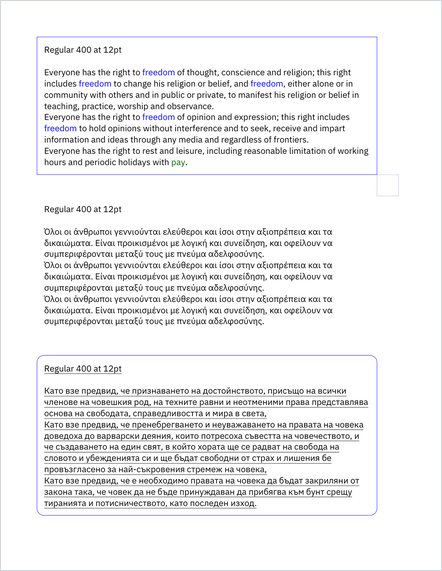
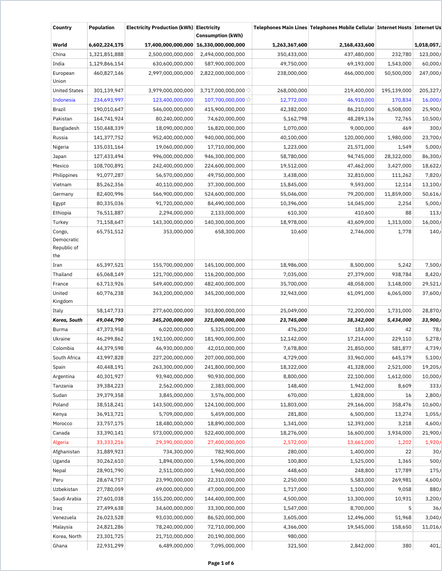
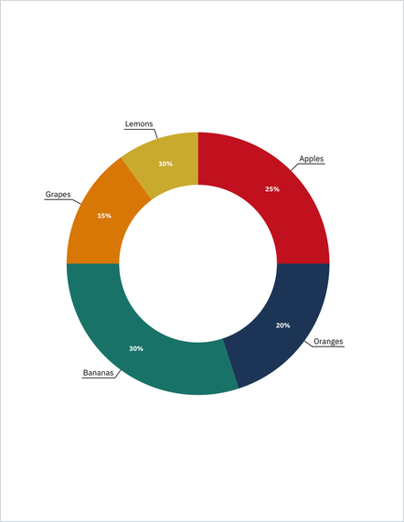
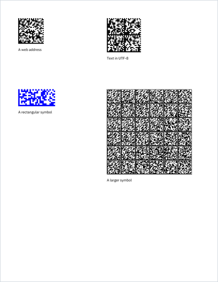

<p align="center">
  
</p>

<h3 align="center">Fast, dependency-free PDF generation for Java, C#, Go and Swift</h3>

<p align="center">
  <a href="https://github.com/edragoev1/pdfjet/actions/workflows/build.yml"></a>
  <a href="https://github.com/edragoev1/pdfjet/actions/workflows/docs.yml"></a>
  <a href="LICENSE"></a>
  
  
  
  
</p>

<p align="center">
  <a href="https://edragoev1.github.io/pdfjet/">Documentation</a> ·
  <a href="examples">Examples</a> ·
  <a href="CHANGELOG.md">Changelog</a>
</p>

PDFjet creates PDF documents: text in any script, tables, charts, barcodes and
images, accessible and archival when you need it to be. The same API and the
same output come in four languages, and none of them needs a single dependency.

## Why PDFjet

- **Accessible and archival PDFs in one setting.** PDF/UA-1 and PDF/A-1a, 1b,
  2a, 2b, 3a and 3b are built in, and the examples are checked with
  [veraPDF](https://verapdf.org/) on every push.
- **One API, four languages, the same PDF.** Java, C#, Go and Swift share the
  API, and CI compares the PDFs of every port with Java's, page by page.
- **Fast and light.** Every port writes a 500-page document with an embedded
  font in under 100 ms, and each page is written out and freed as soon as the
  next one starts.
- **No dependencies.** The Java library is a single 0.39 MB jar.
- **Layout built in.** Tables that break across pages and repeat their header
  rows, text blocks, columns, charts and calendars.
- **Barcodes built in.** EAN-13, UPC-A, Code 39, Code 128, QR, Data Matrix and
  PDF417.
- **Fonts ready to use.** 272 font files from the IBM Plex, Noto and other
  families, compressed once ahead of time, with Unicode text in Latin, Greek,
  Cyrillic, CJK and right to left scripts.
- **Images.** PNG, JPEG and BMP, and SVG drawn as vector graphics.
- **Security.** AES-256 encryption with passwords and permissions, reading
  existing and encrypted PDFs, and limits that keep untrusted input from
  exhausting memory.

<table>
  <tr>
    <td align="center"><a href="examples/Example_01.java"></a><br>Text in any script</td>
    <td align="center"><a href="examples/Example_34.java"></a><br>Tables</td>
    <td align="center"><a href="examples/Example_25.java"></a><br>Charts</td>
    <td align="center"><a href="examples/Example_14.java"></a><br>Barcodes</td>
  </tr>
</table>

## Quick start

Each snippet writes `hello.pdf` with a line in English, Greek and Bulgarian.
The bundled fonts, such as `IBMPlexSans.Regular`, are paths relative to the
working directory, so run the program in a folder that has this repository's
`fonts` directory.

<details open>
<summary><b>Java</b></summary>

Build `PDFjet.jar` with `./build-java.sh`, which also runs the examples, and
put it on the class path.

```java
import com.pdfjet.*;
import com.pdfjet.fonts.*;
import java.io.*;

public class Hello {
    public static void main(String[] args) throws Exception {
        PDF pdf = new PDF(new BufferedOutputStream(new FileOutputStream("hello.pdf")));
        Font font = new Font(pdf, IBMPlexSans.Regular).setSize(18f);
        Page page = new Page(pdf, Letter.PORTRAIT);
        new TextLine(font, "Hello, World! Γειά σου, κόσμε! Здравей, свят!").setLocation(50f, 100f).drawOn(page);
        pdf.complete();
    }
}
```

</details>

<details>
<summary><b>C#</b></summary>

Build `bin/release/net8.0/PDFjet.dll` with `./build-dotnet.sh` and reference it.

```csharp
using System.IO;
using PDFjet.NET;

public class Hello {
    public static void Main() {
        var pdf = new PDF(new BufferedStream(new FileStream("hello.pdf", FileMode.Create)));
        var font = new Font(pdf, IBMPlexSans.Regular).SetSize(18f);
        var page = new Page(pdf, Letter.PORTRAIT);
        new TextLine(font, "Hello, World! Γειά σου, κόσμε! Здравей, свят!").SetLocation(50f, 100f).DrawOn(page);
        pdf.Complete();
    }
}
```

</details>

<details>
<summary><b>Go</b></summary>

```bash
go get github.com/edragoev1/pdfjet/v9@latest
```

```go
package main

import (
	"log"

	pdfjet "github.com/edragoev1/pdfjet/v9/src"
	"github.com/edragoev1/pdfjet/v9/src/IBMPlexSans"
	"github.com/edragoev1/pdfjet/v9/src/letter"
)

func main() {
	pdf, err := pdfjet.NewPDFFile("hello.pdf")
	if err != nil {
		log.Fatal(err)
	}
	font := pdfjet.NewFontFromFile(pdf, IBMPlexSans.Regular).SetSize(18)
	page := pdfjet.NewPage(pdf, letter.Portrait())
	pdfjet.NewTextLine(font, "Hello, World! Γειά σου, κόσμε! Здравей, свят!").SetLocation(50, 100).DrawOn(page)
	if err := pdf.Complete(); err != nil {
		log.Fatal(err)
	}
}
```

The module path carries the major version, as Go requires from v2 on. The Go
module has the source of the library and the examples only: the fonts, the
data files and the images would make it larger than the 500 MiB Go allows, so
`fonts/`, `data/` and `images/` each have a `go.mod` that keeps them out. Copy
the `fonts/` directory of this repository next to your program; the core fonts
need no files.
</details>

<details>
<summary><b>Swift</b></summary>

Add PDFjet to the `Package.swift` of your package:

```swift
dependencies: [
    .package(url: "https://github.com/edragoev1/pdfjet.git", from: "9.0.0"),
],
targets: [
    .executableTarget(name: "App", dependencies: [
        .product(name: "PDFjet", package: "pdfjet"),
    ]),
]
```

```swift
import Foundation
import PDFjet

let pdf = PDF(OutputStream(toFileAtPath: "hello.pdf", append: false)!)
let font = try Font(pdf, IBMPlexSans.Regular).setSize(18.0)
let page = Page(pdf, Letter.PORTRAIT)
TextLine(font, "Hello, World! Γειά σου, κόσμε! Здравей, свят!").setLocation(50.0, 100.0).drawOn(page)
try pdf.complete()
```

</details>

## Performance

Each port writing a document with 60 lines of Latin, Greek and Cyrillic text per
page in IBM Plex Sans, the median of 7 runs on an AMD Ryzen 5 5600G. Peak memory
is that of the whole process writing the 500-page document, runtime included.

| Port | 100 pages | 500 pages | Peak memory |
|---|---|---|---|
| Java | 15 ms | 73 ms | 96 MB |
| C# | 22 ms | 70 ms | 57 MB |
| Go | 10 ms | 51 ms | 10 MB |
| Swift | 22 ms | 94 ms | 29 MB |

## Examples

The [examples](examples) folder has 50 examples, the same in every port. Build
a port and run all of its examples, or run one example by its number:

| Port | All examples | One example |
|---|---|---|
| Java | `./build-java.sh` | `./run-java.sh 01` |
| C# | `./build-dotnet.sh` | `./run-dotnet.sh 01` |
| Go | `./build-go.sh` | `./run-go.sh 01` |
| Swift | `./build-swift.sh` | `./run-swift.sh 01` |

On Linux, install these first:

```bash
sudo apt install libc6-dev gcc
```

On Windows, use the `.cmd` scripts of the same names.

## Builds

The `Build` GitHub Actions workflow runs `build-java.sh`, `build-dotnet.sh`,
`build-go.sh` and `build-swift.sh` on every push to `master` and on pull
requests, one job per port. A job fails if the library or an example does not
compile or compiles with a warning, `go vet` reports a problem in the Go port,
an example exits with an error, an example does not create its PDF file, or a
unit test fails. A
second job then checks the PDFs with `.github/scripts/check-example-pdfs.py`:
each example must render the same, with its text in the same fonts, sizes,
colors and positions and the same drawing instructions on every page, in the
C#, Go and Swift ports as in Java, and
each example that declares PDF/A or PDF/UA compliance must pass
[veraPDF](https://verapdf.org/) in all four ports.

To run the same checks locally before pushing, run `./check-examples.sh`. It
builds the four ports and runs their unit tests one after another in the
repository folder and then checks their PDFs, so it needs the four toolchains,
Python 3 and veraPDF.

The `Windows` workflow runs the Windows scripts, `build-java.cmd`,
`build-dotnet.cmd`, `build-go.cmd` and `build-swift.cmd`, on a Windows runner
and checks that every example creates its PDF file. It only runs when started
from the Actions tab.

## Unit tests

Each port has unit tests with the same cases and the same expected values, so
a difference between the ports fails a test. They cover the numbers written in
content streams, the stream filters, page sizes, fonts, text lines, text
blocks, text boxes, cells and tables, right to left text, the page graphics
state, shapes, charts, SVG, PNG and BMP images, bookmarks, layers, writing and
reading back PDFs, encryption with passwords and permissions, and the
barcodes. A test for a known bug is skipped, with the TODO.md item as its
reason.

| Port | Tests | Framework | Run |
|---|---|---|---|
| Java | `tests/java` | JUnit 5 | `./test-java.sh` |
| C# | `tests/dotnet` | xUnit | `./test-dotnet.sh` |
| Go | `src/**/*_test.go` | `testing` | `./test-go.sh` |
| Swift | `tests/swift` | Swift Testing | `./test-swift.sh` |

The tests are not part of the libraries and add no dependency to them.
`test-java.sh` downloads the JUnit console launcher once into `build/junit`
and checks its SHA-256, and builds and runs the tests on Java 8 as on later
releases. The C# tests compile the library sources into the test project, so
they can test internal classes, and restore xUnit from NuGet. The Go tests read
the PngSuite images from the repository, and skip the tests that need the
fonts when the `fonts` directory is not there. The PDFs the tests make stay in
memory, and the files they need to write go to the system's temporary
directory. `./check-examples.sh` runs the unit tests of each port after its
examples.

## Documentation

The API references and the example pages are published at
<https://edragoev1.github.io/pdfjet/>. The `Documentation` GitHub Actions
workflow rebuilds and publishes the site on every push to `master`, so the
generated HTML is not kept in git. The workflow also runs the Java examples and
publishes the PDF files they create, which the example pages link to. This
needs the repository's Pages source
(Settings > Pages) set to GitHub Actions.

To build them locally, `./generate-documentation.sh` runs Javadoc for the Java
port into `docs/java`, and [DocFX](https://dotnet.github.io/docfx/) for the C#
port into `docs/dotnet`. DocFX reads the XML doc comments (`/// <summary>`) in
`net/pdfjet`; its configuration is in `docfx/`. Install DocFX once with
`dotnet tool install -g docfx`. The Go reference is built with
[doc2go](https://abhinav.github.io/doc2go/) from the doc comments in `src` into
`docs/go`, leaving out the example programs in `src/examples`. The script runs
doc2go v0.12.2 with `go run`, so it needs no install. The Swift reference is built
with [DocC](https://www.swift.org/documentation/docc/), which comes with the
Swift toolchain, from the doc comments in `Sources/PDFjet` into `docs/swift`.
Its pages expect to be served from `/pdfjet/swift/`, so they do not work when
opened straight from disk.

## Java compatibility

The Java library and examples compile and run on Java 8 and later. With JDK 9
or newer, the Java build scripts pass `javac --release 8`, so `PDFjet.jar` and
the examples run on Java 8 whichever JDK builds them, and any API newer than
Java 8 is rejected. Java 8's `javac` has no `--release` option, so the scripts
leave it out there; that `javac` builds Java 8 class files anyway.

## Which class to use

PDFjet has several classes that draw text and two that group content. Each
has one job:

| Class | Use it for |
|---|---|
| `TextLine` | One line of text in one font: a title, a label, a value. It does not wrap. |
| `TextBlock` | One run of text in one font that wraps at its width: a note, a table cell, a paragraph in a box. It breaks words that do not fit, wraps right to left and Thai text, highlights keywords, and can be cut to a height with the lines aligned to the top, center or bottom. |
| `TextColumn` | Paragraphs of `TextLine` objects that differ in font, size or color, drawn in one place: an article page with bold or colored words, justified paragraphs, CJK paragraphs, or a rotated column. |
| `TextFrame` | Paragraphs that continue from one frame to the next: the columns of an article or the pages of a long text. `hasMoreText` says whether a next frame is needed. |
| `Container` | A group of drawable elements, shapes, text, images, annotations and other containers, that are moved, rotated and scaled together and drawn into a page. |
| `Stamp` | Content that repeats on many pages, like a header, a footer or a watermark. It is written once as a form XObject and each placement is a single operator, so the file stays small. |

`Table` and `BigTable` draw tables, with a `TextBlock` in a cell when the
cell text needs wrapping. Example_01, 10, 16, 19, 35 and 47 show these classes.

## Right to left text

`Bidi.reorderVisually` prepares a line of Hebrew, Arabic, Persian or Urdu text
for drawing. It puts the line in visual order, with left to right text such as
Latin words and numbers nested in it one level deep, and replaces the Arabic,
Persian and Urdu letters with their joined forms, including the lam-alef
ligature. `TextBlock.setRightToLeft(true)` wraps right to left text at the
width of the text block and prepares each line that way. Example_27 shows both.

The letters are shaped by replacing them with the presentation forms that fonts
map to Unicode. PDFjet does not use a font's OpenType substitution table (GSUB),
and uses only the mark positioning of its positioning table (GPOS), so:

- Urdu is drawn in the Naskh style of the Arabic fonts, not in Nastaliq, the
  style Urdu is usually printed in. Nastaliq fonts, such as Noto Nastaliq
  Urdu, depend on the OpenType tables, so they are not expected to work.
- Diacritics are positioned on their letters only in a font read from a `.otf`
  or `.ttf` file, as described in [Marks](#marks). In a font read from a
  `.otf.stream` or `.ttf.stream` file they are drawn where the font puts them
  by default: IBM Plex Sans Arabic draws every mark above its letter, and
  Hebrew niqqud falls between letters.
- The marks on a lam-alef ligature are put on its lam.
- A font's localized forms, such as the Urdu shapes of some digits, and its
  optional ligatures and kerning are not used.
- Only the letters of Arabic, Persian and Urdu are shaped. Letters used only by
  other languages written in Arabic script, such as Pashto, Sindhi or Kurdish,
  are drawn unjoined.
- Each string is laid out as a right to left line. The explicit embedding,
  override and isolate controls are left out, and text that is already shaped
  into presentation forms is not supported.

Right to left text is drawn in visual order, and PDF viewers put it back in
logical order when the text is copied or extracted. The joined letters map back
to the letters they stand for, so the words come out as typed, but:

- A bracket in right to left text is drawn with the glyph of its mirror image,
  and the viewers reverse the line without mirroring the brackets back. So
  `Bidi.reorderVisually` puts a right-to-left mark (U+200F) before each bracket
  it mirrors, and PDFjet draws the bracket in a marked content span that has
  the bracket that was typed as its ActualText, and does not draw the mark.
  Brackets around left to right text, as in `مرحبا (hello) عالم`, stay with
  that text when it is copied, so `Bidi.reorderVisually` puts a left-to-right
  mark (U+200E) on each side of the run instead, and PDFjet draws the run,
  brackets included, in one span whose ActualText is its text between the two
  marks. Poppler and MuPDF then copy the brackets on the right sides of the
  text, and the two marks, which are invisible, with it. MuPDF can move a
  bracket at either end of a line to the other end, and Poppler puts a space
  before a closing bracket after a word whose last letter has a mark, as in
  `(كَتَبَ )`.
- The zero width non-joiner and joiner, as in `می‌خواهم`, are not drawn, but
  each is put in the ActualText of the glyph before it, with a space glyph that
  takes no room standing in for it, so Poppler and MuPDF copy them. A font that
  has glyphs for them, like IBM Plex Sans Devanagari, draws those instead. A
  joiner inside a lam-alef ligature is left out.
- Poppler separates an Arabic comma or a period from the word before it, as in
  `مادر ،`, and MuPDF moves numbers, such as `۱۴۰۳`, next to a word beside
  them.

Marking the lines with their text in logical order as ActualText does not help:
Poppler and MuPDF reverse that text as well.

## Text without spaces between words

`TextBlock` wraps text at its spaces. Thai, Lao, Khmer and Burmese text has no
spaces between its words, so put a zero width space (U+200B) between the words
where a line may break. It is not drawn. A word too wide for a line by itself
is broken between its characters, so text without zero width spaces still fits
in the text block, but its lines can break inside words. A right to left word is
shaped as a whole before it is broken, so its letters keep their joined forms on
both sides of the break. The Thai text of Example_27,
`data/languages/thai.txt`, has a zero width space between its words.

## Marks

A mark, like a Hebrew or Arabic vowel mark or a Thai tone mark, is moved to
where the GPOS table of the font puts it: on its letter or ligature, or on the
mark it attaches to, like a Thai tone mark above an upper vowel or an Arabic
fatha above a shadda. The marks of a letter are stacked in the order HarfBuzz
puts them in, so the stacking does not depend on the order they were typed in.
Only a font read from a `.otf` or `.ttf` file has the table: a `.otf.stream` or
`.ttf.stream` file does not, so its marks are drawn where the font puts them by
default, and a mark on another mark is drawn on top of it. Example_27 reads its
Thai font from `fonts/IBMPlexSansThai/IBMPlexSansThai-Regular.otf` for this
reason.

Text extraction tools take a mark that is moved up or down for text off the
line, and break the word at it. Each word with a moved mark is drawn in a
marked content span that has the text of the word as its ActualText, so Poppler
extracts the word whole. MuPDF 1.27 extracts the letters and marks in order,
but puts spaces inside some of these words, after a moved mark, going by the
positions of the glyphs rather than by the ActualText.

## Encryption

`Encryption` encrypts a PDF with 256-bit AES, revision 6 of the standard
security handler of ISO 32000-2, with a user password, an owner password and
the permissions granted to the user. Example_30 shows it in all four ports. The
Java, C# and Go ports use the ciphers and hash functions of their platforms.
Swift has no cryptography in its standard library on Linux, and this library has
no dependencies on external packages, so the Swift port has its own AES, SHA-2,
MD5 and RC4 in `Sources/PDFjet/Cryptography.swift`, which its `Decryptor` uses
as well. The four ports write the same encryption dictionary, with random salts
in the password hashes.

A password is used as typed, in UTF-8, and at most 127 bytes of it are used,
which is where PDF readers cut it too. (The Poppler command line tools, such as
`pdftotext -upw`, take passwords of at most 32 characters; MuPDF and qpdf take
the full length.) ISO 32000-2 also asks for the SASLprep
normalization of the password, which none of the ports applies: Go has no
Unicode normalization without an external package, and the ports are kept the
same. Type passwords in precomposed (NFC) form, as keyboards produce them. A
password that is not set is empty, so a PDF whose user password is not set opens
without a prompt, with the permissions applied.

`PDF.read` also reads encrypted PDFs, made by PDFjet or by other producers:
RC4 and AES-128 (revisions 2 to 4 of the standard security handler) and AES-256
(revisions 5 and 6). A PDF that opens without a password is decrypted by the
plain `read`. For one that needs a password, pass its user or owner password to
`read(inputStream, password)` in Java and C#, `ReadWithPassword(buf, password)`
in Go, or `read(from:password:)` in Swift. A wrong password raises an error
that says so, and so does a missing one; in Go, `Read` and `ReadWithPassword`
return it.

A PDF/UA file may be encrypted; a PDF/A file may not. ISO 14289-1 requires an
encrypted PDF/UA file to grant the permission to extract content for
accessibility, so `Encryption` grants it when the compliance is PDF/UA, whatever
the `Permissions` say. Set the compliance before the encryption for this to
apply. Such a file passes veraPDF's ua1 check with `--password` in all four
ports. veraPDF 1.30.2 computes a wrong file key for about one in forty AES-256
files, whichever producer made them, because the loop of its password hash
(ISO 32000-2 Algorithm 2.B) runs one round too many when the last byte of the
round's output is exactly the round number minus 31; it then reports *Can't
decrypt string* and a metadata parsing failure. Poppler and MuPDF open
those files, and so does `PDF.read`. The Swift AES in `Cryptography.swift`
encrypts about 40 MB per second in a release build and 1 MB per second in a
debug build.

## Untrusted input

The libraries read PDFs, images and fonts that can come from anywhere, so the
sizes in them are checked before they are used, in the four ports. A stream of
a PDF, a font stream, or the samples of a PNG or BMP image may decode to at
most 256 MiB, and a larger one fails with an error instead of taking the
memory: a few kilobytes of Flate, LZW or RunLength data can decode to
gigabytes. The size, bit depth, color type and palette of a PNG or BMP image
are checked before any buffer is allocated for the image, a PNG chunk is read
as far as the file has it, so a length that the file does not have fails at
its end, and the rows of a PNG image are decoded up to the size of the image.
A PDF that the libraries write can be up to 9,999,999,999 bytes long, the
largest offset that an entry of a cross-reference table holds; a larger one
fails with an error.

## Mistakes that are refused

PDFjet does not write a broken PDF when a program uses the API the wrong way.
The call that finds the mistake fails with a message that names it, and
`complete()` then refuses to finish the document, even when the program caught
the exception and carried on. These mistakes are refused:

- a coordinate, size or width that is NaN, infinite, or 2^31 or more;
- a dash pattern that is not an array of non-negative numbers, not all zero,
  followed by a phase, such as `"[3 3] 0"`, and a negative pen width;
- a `restoreGraphicsState` without its `saveGraphicsState`, an `addEMC` without
  its `addBDC` or `addArtifactBMC`, and a page that ends with one still open;
- drawing on a page after the next page was created or the PDF was completed,
  adding a page twice, after `complete()` or to another PDF, calling
  `complete()` twice, and completing a PDF that has no pages;
- a font, image, stamp, optional content group, embedded file or bookmark page
  that belongs to another PDF, a stamp drawn before its own `complete()`, and
  stamp text without a font or a text, or in a core or CJK font;
- `setEncryption` or `setCompliance` after a font, an image or a page was added;
- a page smaller than 3 or larger than 14,400 points, the limits of the PDF
  specification.

Characters that XML does not allow are left out of the XMP metadata, and an
image, stamp or container scaled to nothing draws nothing.

Java throws an `IllegalArgumentException` for a bad value and an
`IllegalStateException` for a call at the wrong time; C# throws an
`ArgumentException` and an `InvalidOperationException`. Go and Swift record the
first mistake and carry on, leaving out what they can, and `Complete` returns
the mistake as an error, or `complete()` throws it; a Go function that already
returns an error, or a Swift function that already throws, reports it at once
as well.

## Port differences

Public setters return the object they were called on, so calls can be chained.
The `Drawable` interface declares `drawOn` and `setLocation` in all four ports.
Java, C# and Swift let each class return its own type from `setLocation`. Go
does not: a Go type only satisfies an interface with an exact signature match,
so in Go the `SetLocation` of a `Drawable` type returns `Drawable`, and in a
chain of setter calls it goes last, right before `DrawOn`:

```go
image.ScaleBy(0.5).SetLocation(50.0, 50.0).DrawOn(page)
```

`DrawOn` returns the x and y coordinates of the bottom right corner of the
component, as a `float[]` in Java and C#, a `[Float]` in Swift and a
`[2]float32` in Go. `DonutChart.drawOn` returns the bottom right corner of the
outer circle of the chart; the slice labels can extend past it.

`Bidi.reorderVisually(str, from, to)` counts `from` and `to` in the units that
each language indexes its strings with: UTF-16 code units in Java and C#, as
`length` and `substring` do, bytes in Go (`ReorderVisuallyPart`), as `len` and
slicing do, and Unicode scalars in Swift, where a `String` has no integer
indexes, as its `unicodeScalars` view does.

Where Java and C# throw an `Exception` with a message, Swift throws a
`PDFjetError`, whose `message` and `description` are that message, and Go
returns an `error`, or panics where the function returns none. `drawOn` throws
in Java and C# and panics in Go, but not in Swift, so the Swift `Barcode`
initializer checks what the other ports check in `drawOn`, Code 39 text and
the barcode type, and throws the same messages from `init`. A mistake that
would break the PDF is reported through `Complete` in Go and `complete()` in
Swift; see "Mistakes that are refused".

`Permissions` takes the `UserAccess` values as a typed flags value in C# (a
`[Flags]` enum) and Go (a `UserAccess` bit set), and as an `int` in Java and
Swift, where the values of the `UserAccess` enum are combined with `|` on
`getValue()`, as Example_30 shows. Java has no flags enum, and a Swift
`OptionSet` is a struct, not an enum, so both ports keep the enum with the bit
values of the standard and the `int` that `Permissions` masks and checks. In
all four ports `getAccess` is the `/P` entry of the encryption dictionary
without its reserved bits, and `UserAccess.isSetIn(flags)` (Go `IsSetIn`, C#
`HasFlag`) asks whether one permission is in it.

`./audit-api.py` lists the public types and members of the four ports, matches
them by name without regard to case and underscores, and prints what is not in
every port and what takes a different number of parameters, so a change to a
public signature can be checked against the other three ports. Its report is
empty apart from the conventions below.

### Names, overloads and constructors

The Java name is the reference. C# and Go use its PascalCase form
(`setLocation`, `SetLocation`), Swift the same camelCase name with unlabelled
arguments. Coordinates and sizes are `float` in Java and C#, `Float` in Swift
and `float32` in Go, with no `double` overloads: a Java or C# caller writes
`50f` or casts a `double`. Swift has one form with default arguments where Java
has a shorter overload,
and Go, which cannot overload, gives the other form a suffix:
`SetTextColorRGB` for `setTextColor(float[])`, `DrawStringUsingFontSize` and
`DrawStringUsingSpacing` for the `drawString` overloads, `StringWidthFB` for `stringWidth` with a fallback font,
`DrawCircleUsingPathOperator` for `drawCircle` with an operator, and
`AddCoreFontResource`, `AddFontResource` and `AddImageResource` for the
`addResource` overloads of `Page` and `PDFobj`. Every color setter takes an
`int` like `Color.blue` or the red, green and blue components from 0 to 1 as a
`float[]` (`[Float]` in Swift, `[3]float32` in Go, with the `RGB` suffix).

Constructors are `New<Type>` functions in Go, again with a suffix for an
overload: `NewBookmarkAt`, `NewEmbeddedFileAtPath`, `NewImageForObjects`, `NewPageDetached` for
`Page.DETACHED`, `NewTableFromFile`, and `NewFont`,
`NewFontFromFile`, `NewCoreFont`, `NewCJKFont`, `NewFontStream1` and
`NewFontStream2` for the overloads of the `Font` constructor, and
`NewEmptyCell(font)` and `NewEmptyTextLine(font)` for `Cell(font)` and
`TextLine(font)`. Where the other ports have an overload with fewer
arguments, Go has the full form only:
`NewLine`, `NewRect` and `NewPoint` with their
coordinates, `NewParagraph()`,
`Table.SetData(data, headerRows)` and `Page.AddBDC` with the language.
The `PDF` constructors are `NewPDF(writer)`, `NewPDFFile(path)`, which opens
the file and returns an error when it cannot, and `NewPDFReader()` for the
`PDF()` of the other ports that only reads documents; `Complete` returns the
first error writing the document, where the other ports throw it.
`content.GetFromReader` is `Content.getFromStream`, and Go's `PDF.Read` and
`ReadWithPassword` take the whole PDF as a `[]byte` where the other ports read
it from a stream. Java's `Encryption` is in `com.pdfjet`, next to `PDF`, so the
two share their package-private members; `Passwords`, `Permissions` and
`UserAccess` are in `com.pdfjet.encryption`.

### Constants and fields in Go

Java, C# and Swift keep constants in classes; Go keeps them in packages:
`color.Blue` for `Color.blue`, `shape.Circle` for `Shape.CIRCLE`,
`structelem.P` for `StructElem.P`, `border.Top`, `compliance.PDF_UA_1`,
`direction`, `scriptposition`, `capstyle`, `joinstyle`, `pagelayout`, `pagemode`,
`pathoperator`, `mark` and the font families
(`IBMPlexSans.Regular`). The constants of a package have its type, as
`alignment.Alignment` and `pathoperator.PathOperator`, so a plain `int` or
`string` variable does not compile where one is expected. The core fonts are
functions, `corefont.Courier()`, where the other ports have
`CoreFont.COURIER`. The page sizes are functions too, `letter.Portrait()` for
`Letter.PORTRAIT`, because a caller can assign to a Go package variable. In all
four ports a page size is a `PageSize` that cannot be changed, with `getWidth`
and `getHeight`; Go's is `pagesize.PageSize`, made with `pagesize.NewPageSize`
for a size that has no package. The QR code error correction levels are
`qrcode.ErrorCorrectionLevelL` and so on. Fields are private in every port;
`Paragraph` and `Title` have the getters an example needs (`getX1`,
`getPrefix`). `Permissions` prints through `String()` in Go and `description`
in Swift where Java and C# have `toString`.

Two conventions hold in every port. A rotation is `setRotation(degrees)` and a
positive angle turns counterclockwise, on shapes, images, pages and text alike.
A spacing setter that takes points is a gap (`setLineGap`, `setParagraphGap`)
and one that takes a multiple of the line is a spacing (`setLineSpacing`,
`setParagraphSpacing`).
